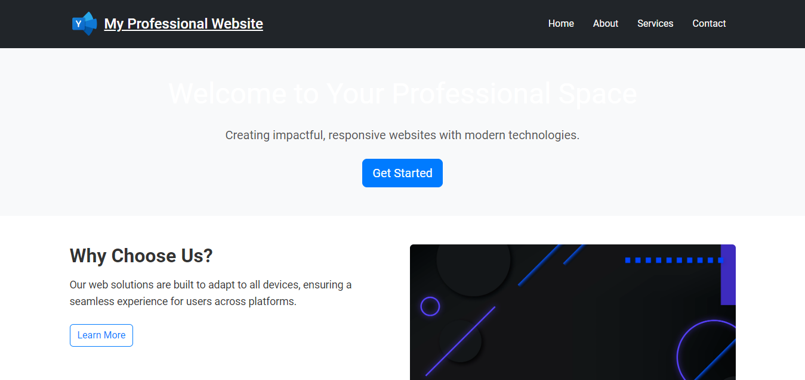

# DEP-Intership-Projects

## Responsive Layouts / Interactive UI Components /  / 

## Using HTML,CSS &  bootstrap for responsiveness !

<h2 align="center">
  <a href="https://dep-intership-projects-faseeh.vercel.app/" target="_blank">Responsive-layout-Faseeh.vercel.app</a>
</h2>
<div align="center">
  
  </div>

## Built With

This projects was built using these technologies.

- Html
- Css
- Bootstrap
- VsCode
- Images


## Features

**📃 Markdown Support**

**✏️ Easy to customize and write of your own**

**🎨 Styled with Simple Css**

## Getting Started

### 🛠 Installation and Setup Instructions

To get started just clone this repository. You will need to download live server on your machine.

Run

```
run on live server
```

Open with port: 5500 your browser to see the result.

## Usage Instructions

To write your own create a new index.html and modify according to your own on requirements.

### Show your support

Give a ⭐ if you like this website!
